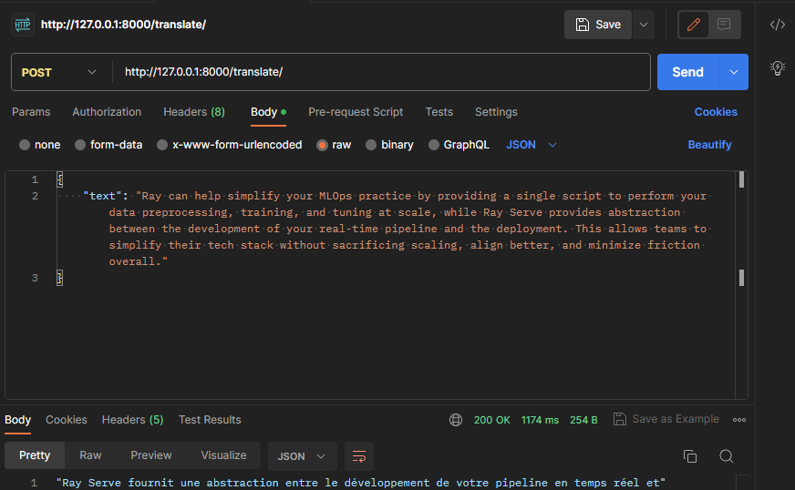
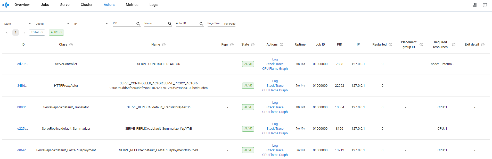
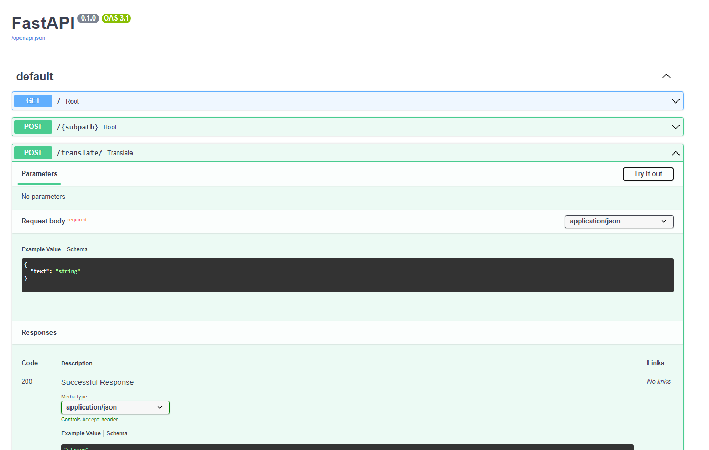
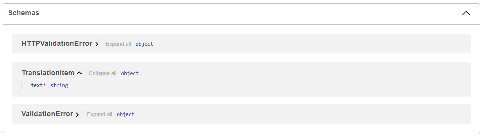

# Ray Serve Multiple-Model application With FastAPI

A basic example of a Ray Serve application. It demonstrates composing multiple-model machine learning models together into a single application; it combines multiple machine learning models (Summarize English text & Translate the summary into French) into a single API endpoint:



For the API, integrate with FastAPI to define more complex HTTP handling logic. This allows you to define a Serve deployment using the `@serve.ingress` decorator that wraps a FastAPI app with its full range of features (e.g. Automatic docs etc.)

## Running

To test locally, we run the script with the `serve run` CLI command. This command takes in an import path to our deployment formatted as `module:application`. Make sure to run the command from the directory containing the `main.py` file, so it can import the application:

```bash
serve run main:app
```

This command will run the FastApi application and then block, streaming logs to the console. It can be killed with `Ctrl-C`, which will tear down the application.

## Features

### Ray Dashboard

Ray provides a web-based dashboard for monitoring and debugging Ray applications. The visual representation of the system state, allows users to track the performance of applications and troubleshoot issues:



Here, we can:

- Analyze, monitor, or visualize status and resource utilization metrics for logical or physical components: Metrics view, Cluster view
- Monitor Job and Task progress and status: Jobs view
- Locate logs and error messages for failed Tasks and Actors: Jobs view, Logs view
- Analyze CPU and memory usage of Tasks and Actors: Metrics view, Cluster view
- Monitor a Serve application: Serve view

### Automated Docs

FastAPI provides Interactive API documentation and exploration web user interfaces. As the framework is based on `OpenAPI`, there are multiple options, 2 included by default. This one is Swagger UI, with interactive exploration, so you can call and test your API directly from the browser.



Since we declared our data model as a class that inherits from `BaseModel` from `Pydantic` like this:

```python
from pydantic import BaseModel
class TranslationItem(BaseModel):
    text: str
```

The JSON Schema of the model will be part of the OpenAPI generated schema, and will be shown in the interactive API docs:



Alternative API documentation with ReDoc is also available.

## Resources

- [Ray Started Guide](https://docs.ray.io/en/latest/serve/getting_started.html)
- [Ray Http Guide](https://docs.ray.io/en/latest/serve/http-guide.html)
